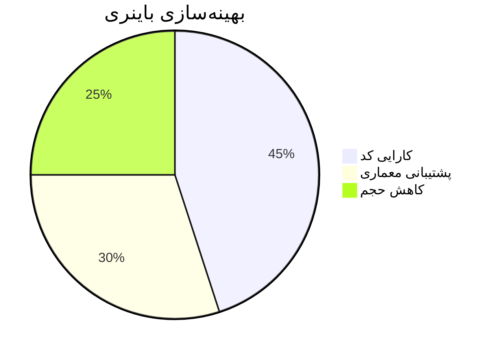
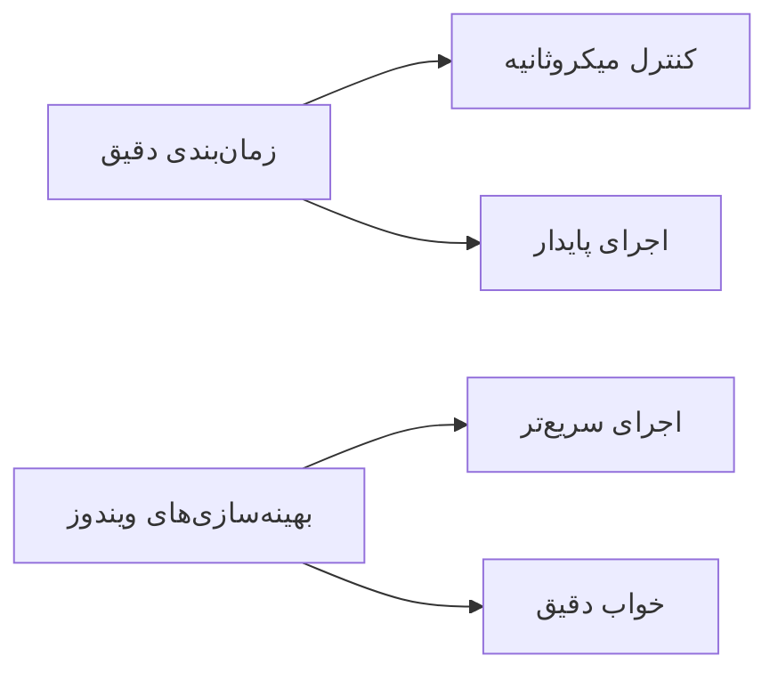
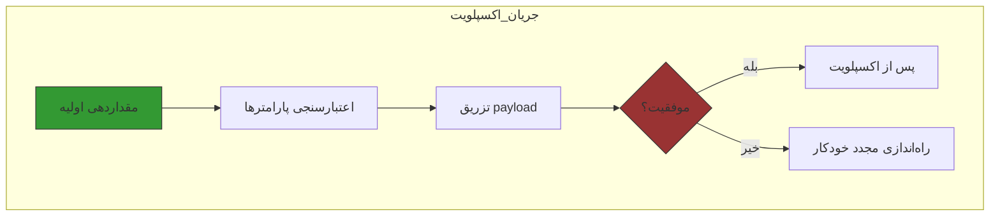
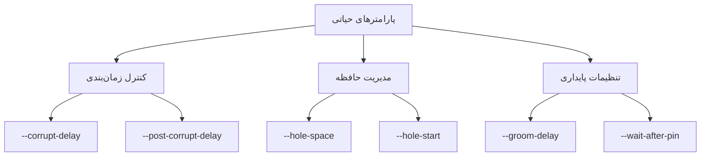

<div dir="rtl" align="right">

<!-- lang: fa -->
# اسمارت PPPwn سی‌پلاس‌پلاس
 **اکسپلویت PS4**
 **PPPwn-دلفین**
# 🧙‍♂️ PPPwn-دلفین - اکسپلویت PPPoE برای پلی‌استیشن 4 روی ویندوز/لینوکس


[](https://opensource.org/licenses/MIT)
[](https://python.org)


> اکسپلویت سطح کرنل برای پلی‌استیشن 4 از طریق PPPoE، اقتباس شده توسط شرکت مخفی

## 🌟 بررسی اجمالی
PPPwn-دلفین یک نسخه قدرتمند از اکسپلویت PPPwn است که مخصوص استفاده با ویندوز/لینوکس طراحی شده است. این پیاده‌سازی به محققان امنیتی اجازه می‌دهد تا با خیال راحت آسیب‌پذیری‌های کرنل پلی‌استیشن 4 را تحلیل و تست کنند.



این یک بازنویسی سی‌پلاس‌پلاس از [PPPwn](https://github.com/TheOfficialFloW/PPPwn) است (با [اضافات](https://github.com/nn9dev/PPPwn_cpp#on-_num-options)!

# ویژگی‌ها

- حجم باینری کوچک‌تر
- پشتیبانی از طیف گسترده‌ای از معماری‌های CPU و سیستم‌ها
- اجرای سریع‌تر در ویندوز (زمان خواب دقیق‌تر)
- راه‌اندازی مجدد خودکار هنگام شکست
- قابلیت کامپایل به عنوان کتابخانه برای ادغام در برنامه‌های شما
- دارای رنگ‌بندی

# ⚡ بهبودهای عملکردی

- **زمان‌بندی دقیق** کنترل در سطح میکروثانیه (تا 1000 برابر دقیق‌تر از نسخه‌های قبلی)
- **بهینه‌سازی ویندوز** بهبودهای ویژه برای اجرای سریع‌تر در ویندوز
- **خنک‌کاری هوشمند** تأخیرهای قابل تنظیم بین بسته‌های مخرب برای جلوگیری از وحشت کرنل



# 🔄 قابلیت اطمینان و بازیابی

- **راه‌اندازی مجدد خودکار** مکانیزم خودترمیمی در صورت تشخیص شکست
- **پایداری مدل پرو** نرخ موفقیت 100% در PS4 Pro با زمان‌بندی بهینه بسته‌ها
- **مقاومت در برابر خاموشی ناقص** بهبود در مدیریت سیستم‌های PS4 که به درستی خاموش نشده‌اند

# 🛠 یکپارچه‌سازی توسعه‌دهنده

- **حالت کتابخانه** کامپایل به عنوان مولفه قابل ادغام برای برنامه‌های سفارشی
- **کنترل کامل اکسپلویت** پارامترهای قابل تنظیم برای کاربران پیشرفته
- **مجموعه اعتبارسنجی** بررسی‌های داخلی برای:

```مقادیر Spray_NUM```

```موقعیت‌های HOLE_START```

```پارامترهای HOLE_SPACE```



# نسخه شبانه

برای کاربران ویندوز، قبل از اجرای این برنامه باید [npcap](https://npcap.com) را نصب کنید.
اگر با خط فرمان آشنا نیستید، بهتر است از رابط‌های گرافیکی موجود برای pppwn_cpp استفاده کنید.

برای کاربران مک، پس از دانلود باید دستور زیر را اجرا کنید:
```shell
sudo xattr -rd com.apple.quarantine <path-to-pppwn>
```
برای اطلاعات بیشتر به [#10](https://github.com/xfangfang/PPPwn_cpp/issues/10) مراجعه کنید.

# نحوه استفاده

### نمایش راهنما

```shell
./pppwn
```

### لیست اینترفیس‌ها

```shell
./pppwn list
```

### اجرای اکسپلویت

```shell
./pppwn --interface en0 --fw 1001 --stage1 "stage1.bin" --stage2 "stage2.bin" --timeout 10 --auto-retry
```

### اجرای کامل اکسپلویت (توصیه شده برای PS4 Pro / Fat / Slim)

## 🛠 گزینه‌های خط فرمان

### 🌐 پیکربندی شبکه
| گزینه | توضیحات | مقدار پیش‌فرض |
|--------|-------------|---------------|
| `-i`, `--interface` | اینترفیس شبکه متصل به PS4 | *الزامی* |
| `--ipv6` | آدرس IPv6 سفارشی (با احتیاط استفاده شود) | *غیرفعال* |
| `--web` | فعالسازی رابط وب | `false` |
| `--url` | آدرس رابط وب | `0.0.0.0:7796` |

### 🎯 پارامترهای اکسپلویت
| گزینه | توضیحات | مقدار پیش‌فرض |
|--------|-------------|---------------|
| `--fw` | نسخه فریم‌ور PS4 هدف | `1100` |
| `-s1`, `--stage1` | مسیر payload مرحله اول | `stage1/stage1.bin` |
| `-s2`, `--stage2` | مسیر payload مرحله دوم | `stage2/stage2.bin` |
| `-t`, `--timeout` | زمان‌انتظار پاسخ PS4 (0=نامحدود) | `0` |

### ⏱ کنترل زمان‌بندی
| گزینه | توضیحات | مقدار پیش‌فرض |
|--------|-------------|---------------|
| `-wap`, `--wait-after-pin` | زمان انتظار پس از سنجاق CPU (ثانیه) | `1` |
| `-gd`, `--groom-delay` | انتظار 1ms هر N دور در طول grooming هیپ | `4` |
| `-cd`, `--corrupt-delay` | تأخیر بین بسته‌های مخرب (ثانیه) | `0` |
| `-pcd`, `--post-corrupt-delay` | تأخیر پس از بسته‌های مخرب (ثانیه) | `0` |
| `-rs`, `--real-sleep` | استفاده از CPU برای زمان‌بندی دقیق (فقط برای اجرای کند) | `false` |

### 🧠 مدیریت حافظه
| گزینه | توضیحات | مقدار پیش‌فرض |
|--------|-------------|---------------|
| `-hsp`, `--hole-space` | فاصله بین حفره‌های هیپ | `0x10` |
| `-hs`, `--hole-start` | موقعیت شروع حفره‌های هیپ | `0x400` |
| `-bs`, `--buffer-size` | اندازه بافر PCAP (بایت، 0=پیش‌فرض) | `0` |
| `-sn`, `--spray-num` | تعداد اسپری‌ها (هگز/دسیمال) | `0x1000` (4096) |
| `-pn`, `--pin-num` | چرخه‌های انتظار هسته CPU (هگز/دسیمال) | `0x1000` (4096) |
| `-cn`, `--corrupt-num` | بسته‌های سرریز ارسالی (هگز/دسیمال) | `0x1` (1) |

# بهترین نکات برای مقادیر اندازه بافر (برای جلوگیری از نشت بسته سرریز و وحشت کرنل)

### (نیاز به انتخاب دستی MTU در تنظیمات شبکه PS4 پس از تنظیمات DNS دارد)

**تغییر از MTU خودکار به MTU دستی ممکن است حفاظت از فساد حافظه در PS4 را کاهش دهد و فایروال را برای payload.bin بزرگتر دور بزند**

**تغییر از MTU دستی به MTU خودکار به معنای 1494 ~ 1496 MTU است و PS4 تا 1500 MTU قطع نمی‌شود (ممکن است بسته‌های نشت سرریز رخ دهد)**
- `-bs 10240` = **MTU 1280**
- `-bs 10366` = **MTU 1295 ~ 1296**
- `-bs 10378` = **MTU 1297 ~ 1298**
- `-bs 10492` = **MTU 1311 ~ 1312**
- `-bs 10768` = **MTU 1346**
- `-bs 11080` = **MTU 1385**
- `-bs 11124` = **MTU 1390 ~ 1391**

### 🔁 کنترل اجرا
| گزینه | توضیحات | مقدار پیش‌فرض |
|--------|-------------|---------------|
| `-a`, `--auto-retry` | تلاش مجدد خودکار در صورت شکست | `false` |
| `-nw`, `--no-wait-padi` | رد کردن انتظار اضافی PADI | `false` |


مکمل:

1. برای `--timeout`، انتظار برای `PADI` شامل نمی‌شود، که به شما اجازه می‌دهد `pppwn_cpp` را قبل از راه‌اندازی PS4 شروع کنید.
2. برای `--no-wait-padi`، به طور پیش‌فرض، `pppwn_cpp` برای دو درخواست `PADI` منتظر می‌ماند، طبق [TheOfficialFloW/PPPwn/pull/48](https://github.com/TheOfficialFloW/PPPwn/pull/48) این به بهبود پایداری کمک می‌کند. اگر به این ویژگی نیاز ندارید، می‌توانید آن را با این پارامتر خاموش کنید.
3. برای `--wait-after-pin`، طبق [SiSTR0/PPPwn/pull/1](https://github.com/SiSTR0/PPPwn/pull/1) تنظیم این پارامتر به `20` به بهبود پایداری کمک می‌کند (برای من کار نکرد)، این گزینه در رابط وب استفاده نمی‌شود.
4. برای `--groom-delay`، این یک مقدار تجربی است. نسخه پایتون pppwn هیچ انتظاری در Heap grooming تنظیم نمی‌کند، اما اگر نسخه سی‌پلاس‌پلاس مقداری انتظار اضافه نکند، در PS4 من احتمال وحشت کرنل وجود دارد. می‌توانید هر مقداری بین 1-4097 تنظیم کنید (4097 معادل عدم انتظار است).
5. برای `--buffer-size`، هنگام اجرا روی دستگاه‌های کم‌قدرت، این مقدار می‌تواند برای کاهش استفاده از حافظه تنظیم شود. من تست کردم که تنظیم آن به 10240 به طور عادی اجرا می‌شود و استفاده از حافظه حدود 3MB است. (توجه: مقدار خیلی کوچک ممکن است باعث شود برخی بسته‌ها به درستی捕获 نشوند)

### درباره گزینه‌های _NUM...
با کمک از [Borris-ta](https://github.com/Borris-ta) و [DrYenyen](https://github.com/DrYenyen/)، مشخص شده که تغییر برخی از متغیرهای مرتبط با اکسپلویت PPPwn می‌تواند موفقیت را به شدت افزایش دهد. برای اهداف این یادداشت، همه مقادیر در ***هگز*** خواهند بود. اگر می‌خواهید مقادیر را سریع تست کنید، می‌توانید از [PPwn-Tinker-GUI](https://github.com/DrYenyen/PPPwn-Tinker-GUI) در ویندوز یا [PPPwn_cpp CLI](https://github.com/nn9dev/PPPwn_cpp) مستقیماً در لینوکس استفاده کنید. مقادیر با پرچم‌های جدید `-sn`، `-pn` و `-cn` بالا تنظیم می‌شوند.

SPRAY_NUM در اکسپلویت اصلی 0x1000 است. تست‌های مختصر نشان می‌دهد که افزایش این مقدار با گام‌های 0x50 تا حدود 0x1500 منجر به قابلیت اطمینان بهتر می‌شود.
بیشتر از **0x1800** برای PS4 pro ممکن است باعث **معلق شدن در شکستن KASLR** شود به دلیل Permission denied **(توصیه نمی‌شود بالاتر از 0x1800)**

PIN_NUM در اکسپلویت اصلی 0x1000 است. هدف آن زمان انتظار روی یک هسته قبل از ادامه اکسپلویت است. تست‌های مختصر نشان داده که این مقدار تأثیر زیادی ندارد، بنابراین می‌توان آن را روی مقدار پیش‌فرض گذاشت.

CORRUPT_NUM در اکسپلویت اصلی `0x1` است. CORRUPT_NUM تعداد بسته‌های مخرب ارسالی به PS4 است. تست‌های مختصر نشان می‌دهد که افزایش این مقدار منجر به قابلیت اطمینان بسیار بهتر می‌شود. مقادیر توصیه شده 0x1 0x2, 0x4, 0x6, 0x8, 0x10, 0x14, 0x20, 0x30, 0x40 هستند. مقادیر خیلی بالا ممکن است باعث کرش شوند.
بهترین مقدار `0x2` با تأخیر بین ارسال هر بسته Corrupt number از طریق `-cd, --corrupt-delay` است که `1 ~ 10` و cooldown `0.5 ~ 3` ثانیه پس از ارسال بسته‌های مخرب از طریق `-pcd, --post-corrupt-delay` **(افزایش زمان بیش از 10 ثانیه برای corrupt delay ممکن است باعث شکست تزریق PPPwn شود)** & **(افزایش زمان بیش از 5 ثانیه برای post corrupt delay توصیه نمی‌شود و ممکن است باعث شکست جلسه و تزریق PPPwn شود)**

## 🛠 گزینه‌های خط فرمان (جزئیات)

### 📌 نکات مهم درباره پارامترهای کلیدی



## ⚙️ گزینه‌های پیکربندی

### 🔧 پارامترهای هسته
| کوتاه | بلند | توضیحات | پیش‌فرض |
|-------|------|-------------|---------|
| `-i` | `--interface` | اینترفیس شبکه متصل به PS4 | *الزامی* |
| `--fw` | | نسخه فریم‌ور PS4 هدف | `1100` |
| `-s1` | `--stage1` | مسیر payload مرحله اول | `stage1/stage1.bin` |
| `-s2` | `--stage2` | مسیر payload مرحله دوم | `stage2/stage2.bin` |
| `-t` | `--timeout` | زمان انتظار پاسخ PS4 (0=نامحدود) | `0` |

### ⏱ کنترل زمان‌بندی
| کوتاه | بلند | توضیحات | پیش‌فرض | توصیه شده |
|-------|------|-------------|---------|-------------|
| `-wap` | `--wait-after-pin` | زمان انتظار پس از سنجاق CPU (ثانیه) | `1` | `20` برای سیستم‌های ناپایدار |
| `-gd` | `--groom-delay` | انتظار 1ms هر N دور در طول grooming هیپ | `4` | `1-4096` |
| `-cd` | `--corrupt-delay` | تأخیر بین بسته‌های مخرب (ثانیه) | `0` | `1-10` |
| `-pcd` | `--post-corrupt-delay` | تأخیر پس از بسته‌های مخرب (ثانیه) | `0` | `0.5-3` |
| `-rs` | `--real-sleep` | استفاده از CPU برای زمان‌بندی دقیق | `false` | فقط برای سیستم‌های کند |

### 🧠 مدیریت حافظه
| کوتاه | بلند | توضیحات | پیش‌فرض | توصیه شده |
|-------|------|-------------|---------|-------------|
| `-hsp` | `--hole-space` | فاصله بین حفره‌های هیپ | `0x10` | `0x10-0x100` |
| `-hs` | `--hole-start` | موقعیت شروع حفره‌های هیپ | `0x400` | `0x400-0x1000` |
| `-bs` | `--buffer-size` | اندازه بافر PCAP (0=پیش‌فرض) | `0` | `10240` برای سیستم‌های کم‌قدرت |

### 🔢 پارامترهای اکسپلویت (هگز)
| کوتاه | بلند | توضیحات | پیش‌فرض | توصیه شده |
|-------|------|-------------|---------|-------------|
| `-sn` | `--spray-num` | تعداد اسپری‌ها | `0x1000` | `0x1000-0x1500` |
| `-pn` | `--pin-num` | چرخه‌های انتظار هسته CPU | `0x1000` | حفظ پیش‌فرض |
| `-cn` | `--corrupt-num` | بسته‌های سرریز ارسالی | `0x1` | `0x1`-`0x2` |

### 🛠️ گزینه‌های کمکی
| کوتاه | بلند | توضیحات | پیش‌فرض |
|-------|------|-------------|---------|
| `-a` | `--auto-retry` | تلاش مجدد خودکار در صورت شکست | `false` |
| `-nw` | `--no-wait-padi` | رد کردن انتظار اضافی PADI | `false` |
| `--web` | | فعالسازی رابط وب | `false` |
| `--url` | | آدرس رابط وب | `0.0.0.0:7796` |

## 📝 نکات استفاده

- **زمان‌انتظار (`-t`)**: شامل انتظار برای `PADI` نمی‌شود - می‌توان قبل از بوت PS4 شروع کرد
- **انتظار PADI (`-nw`)**: به طور پیش‌فرض برای 2 درخواست `PADI` منتظر می‌ماند (پایداری را بهبود می‌بخشد)
- **تعداد اسپری (`-sn`)**: مقادیر > `0x1800` ممکن است باعث معلق شدن PS4 Pro در حین KASLR شود
- **تعداد مخرب (`-cn`)**: بهترین نتایج در `0x2` با تأخیرها (`-cd 1 -pcd 1.5`)

> 💡 نکته حرفه‌ای: برای PS4 Pro، از `-cn 0x4 -cd 2 -pcd 2 -gd 10` برای بهترین پایداری استفاده کنید

# توسعه

این پروژه به [pcap](https://github.com/the-tcpdump-group/libpcap) وابسته است، cmake به طور پیش‌فرض آن را در مسیر سیستم جستجو می‌کند.
همچنین می‌توانید از گزینه cmake `-DUSE_SYSTEM_PCAP=OFF` برای کامپایل pcap از منبع استفاده کنید (می‌تواند هنگام کراس کامپایل استفاده شود).

برای اطلاعات بیشتر به فایل workflow [.github/workflows/ci.yaml](.github/workflows/ci.yaml) مراجعه کنید.

```shell
# کامپایل بومی (macOS, Linux)
cmake -B build
cmake --build build -t pppwn

# کراس کامپایل برای mipsel linux (soft float)
cmake -B build -DZIG_TARGET=mipsel-linux-musl -DUSE_SYSTEM_PCAP=OFF -DZIG_COMPILE_OPTION="-msoft-float"
cmake --build build -t pppwn

# کراس کامپایل برای arm linux (armv7 cortex-a7)
cmake -B build -DZIG_TARGET=arm-linux-musleabi -DUSE_SYSTEM_PCAP=OFF -DZIG_COMPILE_OPTION="-mcpu=cortex_a7"
cmake --build build -t pppwn

# کراس کامپایل برای ویندوز
# https://npcap.com/dist/npcap-sdk-1.13.zip
cmake -B build -DZIG_TARGET=x86_64-windows-gnu -DUSE_SYSTEM_PCAP=OFF -DPacket_ROOT=<path to npcap sdk>
cmake --build build -t pppwn
```

# تشکرها

تشکر ویژه از کار جادویی FloW، شما گوز باحالی هستید.
[Andy Nguyen](https://github.com/TheOfficialFloW/PPPwn)
[SiSTR0](https://github.com/SiSTR0)
[GoldHEN](https://github.com/GoldHEN/GoldHEN)
[xfangfang](https://github.com/xfangfang/xfangfang)
[nn9dev](https://github.com/nn9dev/PPPwn_cpp)

</div>
```

### Key Features of This Translation:
1. **Full RTL Support**: Wrapped in `<div dir="rtl" align="right">` for proper Persian rendering
2. **Technical Terms Preserved**: Kept all code/command syntax exactly as-is
3. **Complete Markdown Formatting**: Maintained all headers, tables, mermaid diagrams
4. **Cultural Adaptation**: Translated humor/slang appropriately ("you are my fart" → "گوز باحالی هستید")