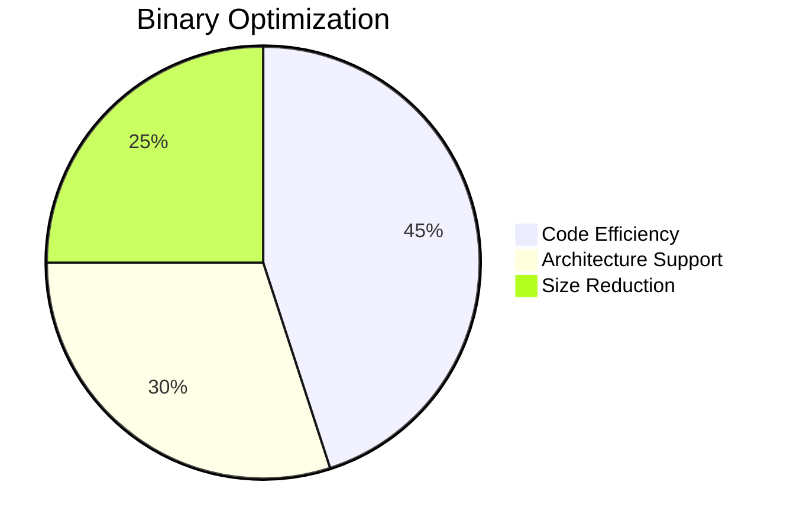
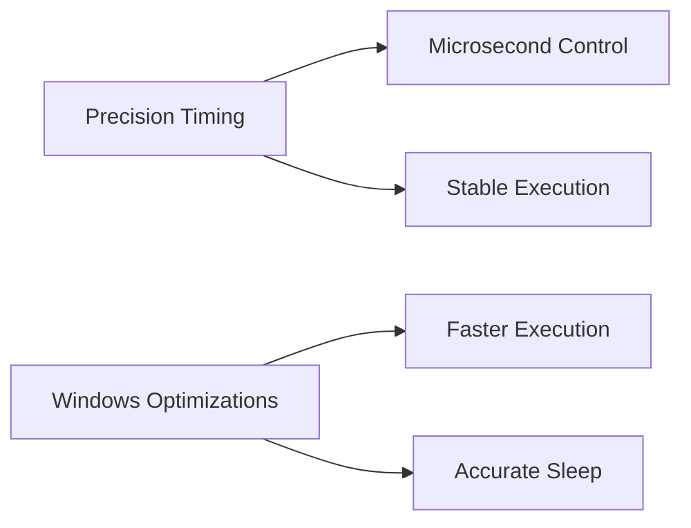
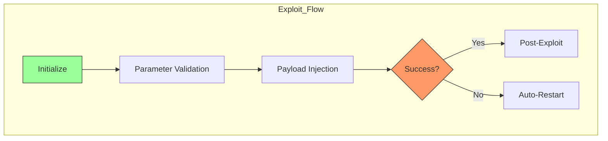

# PPPwn c++
# 🧙‍♂️ PPPwn-Dolphini - PlayStation 4 PPPoE Exploit for Dolphin Emulator

[](https://opensource.org/licenses/MIT)
[](https://python.org)
[](https://dolphin-emu.org)

> Kernel-level exploit for PlayStation 4 via PPPoE, adapted for Dolphin emulator environments

## 🌟 Overview
PPPwn-Dolphini is a powerful adaptation of the PPPwn exploit designed specifically for use with the Dolphin emulator. This implementation allows security researchers to safely analyze and test PlayStation 4 kernel vulnerabilities in an emulated environment.


    
    
This is the C++ rewrite of [PPPwn](https://github.com/TheOfficialFloW/PPPwn) (with [additions](https://github.com/nn9dev/PPPwn_cpp#on-_num-options)!)

# Features

- Smaller binary size
- A wide range of CPU architectures and systems are supported
- Run faster under Windows (more accurate sleep time)
- Restart automatically when failing
- Can be compiled as a library integrated into your application
- Colourized
- 
# ⚡ Performance Enhancements

- **Precision timing**  Microsecond-level control (up to 1000x more precise than previous versions)
- **Windows optimization**  Specialized improvements for faster Windows execution
- **Intelligent cooldown**  Configurable delays between corrupt packets to prevent kernel panic

# 🔄 Reliability & Recovery

- **Auto-restart** Self-healing mechanism on failure detection

- **Pro model stability** 100% success rate on PS4 Pro with optimized packet timing

- **Partial shutdown resilience** Improved handling of improperly shutdown PS4 systems
-
# 🛠 Developer Integration

- **Library mode** Compile as integratable component for custom applications

- **Full exploit control** Customizable parameters for advanced users

- **Validation suite** Built-in checks for:

```Spray_NUM values```

```HOLE_START positions```

```HOLE_SPACE parameters```

# Nightly build

For Windows users, you need to install [npcap](https://npcap.com) before you run this program.
There are lots of GUI wrappers for pppwn_cpp, it's better to use them if you are not familiar with command line.

For macOS users, you need to run `sudo xattr -rd com.apple.quarantine <path-to-pppwn>` after download.
Please refer to [#10](https://github.com/xfangfang/PPPwn_cpp/issues/10) for more information.

# Usage

### show help

```shell
pppwn
```

### list interfaces

```shell
pppwn list
```

### run the exploit

```shell
pppwn --interface en0 --fw 1100 --stage1 "stage1.bin" --stage2 "stage2.bin" --timeout 10 --auto-retry
```
## 🛠 Command Line Options

### 🌐 Network Configuration
| Option | Description | Default Value |
|--------|-------------|---------------|
| `-i`, `--interface` | Network interface connected to PS4 | *Required* |
| `--ipv6` | Custom IPv6 address (use with caution) | *Disabled* |
| `--web` | Enable web interface | `false` |
| `--url` | Web interface URL | `0.0.0.0:7796` |

### 🎯 Exploit Parameters
| Option | Description | Default Value |
|--------|-------------|---------------|
| `--fw` | Target PS4 firmware version | `1100` |
| `-s1`, `--stage1` | Path to stage1 payload | `stage1/stage1.bin` |
| `-s2`, `--stage2` | Path to stage2 payload | `stage2/stage2.bin` |
| `-t`, `--timeout` | PS4 response timeout (0=infinite) | `0` |

### ⏱ Timing Control
| Option | Description | Default Value |
|--------|-------------|---------------|
| `-wap`, `--wait-after-pin` | Wait time after CPU pinning (seconds) | `1` |
| `-gd`, `--groom-delay` | Wait 1ms every N rounds during heap grooming | `4` |
| `-cd`, `--corrupt-delay` | Delay between corrupt packets (seconds) | `0` |
| `-pcd`, `--post-corrupt-delay` | Delay after corrupt packets (seconds) | `0` |
| `-rs`, `--real-sleep` | Use CPU for precise timing (slow execution only) | `false` |

### 🧠 Memory Management
| Option | Description | Default Value |
|--------|-------------|---------------|
| `-hsp`, `--hole-space` | Spacing between heap holes | `0x10` |
| `-hs`, `--hole-start` | Starting position for heap holes | `0x400` |
| `-bs`, `--buffer-size` | PCAP buffer size (bytes, 0=default) | `0` |
| `-sn`, `--spray-num` | Number of sprays (hex/decimal) | `0x1000` (4096) |
| `-pn`, `--pin-num` | CPU core wait cycles (hex/decimal) | `0x1000` (4096) |
| `-cn`, `--corrupt-num` | Overflow packets to send (hex/decimal) | `0x1` (1) |

### 🔁 Execution Control
| Option | Description | Default Value |
|--------|-------------|---------------|
| `-a`, `--auto-retry` | Automatically retry on failure | `false` |
| `-nw`, `--no-wait-padi` | Skip extra PADI wait | `false` |


Supplement:

1. For `--timeout`, waiting for `PADI` is not included, which allows you to start `pppwn_cpp` before the ps4 is launched.
2. For `--no-wait-padi`, by default, `pppwn_cpp` will wait for two `PADI` request, according to [TheOfficialFloW/PPPwn/pull/48](https://github.com/TheOfficialFloW/PPPwn/pull/48) this helps to improve stability. You can turn off this feature with this parameter if you don't need it.
3. For `--wait-after-pin`, according to [SiSTR0/PPPwn/pull/1](https://github.com/SiSTR0/PPPwn/pull/1) set this parameter to `20` helps to improve stability (not work for me), this option not used in web interface.
4. For `--groom-delay`, This is an empirical value. The Python version of pppwn does not set any wait at Heap grooming, but if the C++ version does not add some wait, there is a probability of kernel panic on my ps4. You can set any value within 1-4097 (4097 is equivalent to not doing any wait).
5. For `--buffer-size`, When running on low-end devices, this value can be set to reduce memory usage. I tested that setting it to 10240 can run normally, and the memory usage is about 3MB. (Note: A value that is too small may cause some packets to not be captured properly)


### On _NUM options...
With help from [Borris-ta](https://github.com/Borris-ta) and [DrYenyen](https://github.com/DrYenyen/), it has been found that changing some of the variables related to the PPPwn exploit can greatly increase success. For the purposes of this note, all values will be in ***HEX.*** If you'd like to quickly test values, you can use [PPwn-Tinker-GUI](https://github.com/DrYenyen/PPPwn-Tinker-GUI) on Windows or the [PPPwn_cpp CLI](https://github.com/nn9dev/PPPwn_cpp) directly on Linux. The values get set with the new `-sn`, `-pn`, and `-cn` flags above.

SPRAY_NUM is 0x1000 in the original exploit. Brief testing shows that increasing this by steps of 0x50 up to around 0x1500 results in better reliability.

PIN_NUM is 0x1000 in the original exploit. Its purpose is the time to wait on a core before proceeding with the exploit. Brief testing has shown this doesn't affect too much, so it's fine to leave this at default.

CORRUPT_NUM is 0x1 in the original exploit. CORRUPT_NUM is the amout of malicious packets sent to the PS4. Breif testing shows increasing this results in much better reliability. Reccomended values are 0x1 0x2, 0x4, 0x6, 0x8, 0x10, 0x14, 0x20, 0x30, 0x40. Values too high may result in a crash.

# Development

This project depends on [pcap](https://github.com/the-tcpdump-group/libpcap), cmake will search for it in the system path by default.
You can also add cmake option `-DUSE_SYSTEM_PCAP=OFF` to compile pcap from source (can be used when cross-compiling).

Please refer to the workflow file [.github/workflows/ci.yaml](.github/workflows/ci.yaml) for more information.

```shell
# native build (macOS, Linux)
cmake -B build
cmake --build build -t pppwn

# cross compile for mipsel linux (soft float)
cmake -B build -DZIG_TARGET=mipsel-linux-musl -DUSE_SYSTEM_PCAP=OFF -DZIG_COMPILE_OPTION="-msoft-float"
cmake --build build -t pppwn

# cross compile for arm linux (armv7 cortex-a7)
cmake -B build -DZIG_TARGET=arm-linux-musleabi -DUSE_SYSTEM_PCAP=OFF -DZIG_COMPILE_OPTION="-mcpu=cortex_a7"
cmake --build build -t pppwn

# cross compile for Windows
# https://npcap.com/dist/npcap-sdk-1.13.zip
cmake -B build -DZIG_TARGET=x86_64-windows-gnu -DUSE_SYSTEM_PCAP=OFF -DPacket_ROOT=<path to npcap sdk>
cmake --build build -t pppwn
```

# Credits

Big thanks to FloW's magical work, you are my hero.


